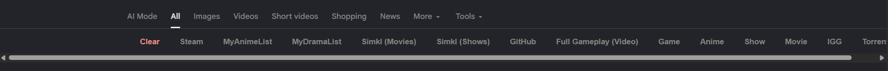
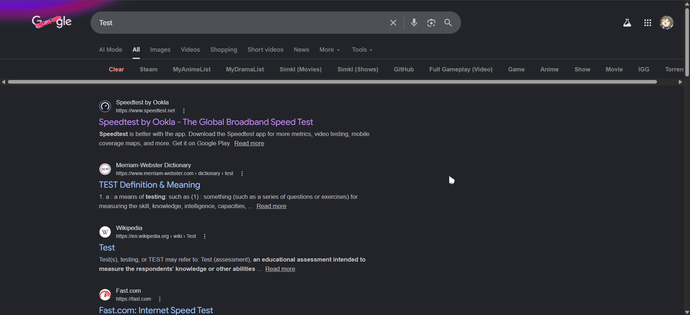
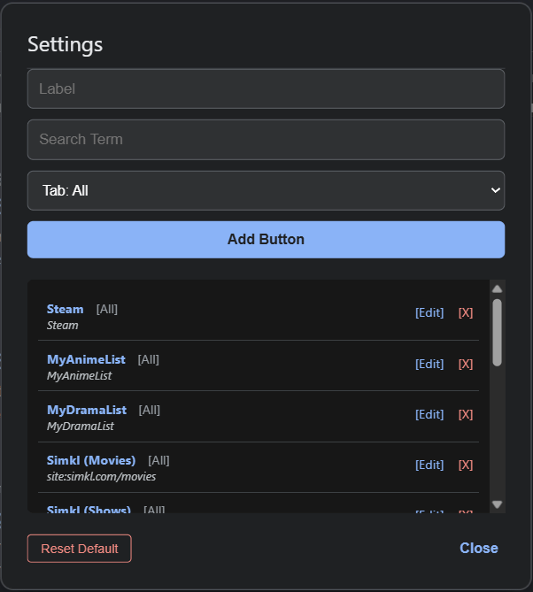

# Chrome Web Search Shortcuts

## Preview 📷

## Install 🔽

* Download .js file from [release](https://github.com/Nayih/ChromeWebSearchShortcuts/releases).
* Drop the .js file into [Tampermonkey](https://chromewebstore.google.com/detail/tampermonkey/dhdgffkkebhmkfjojejmpbldmpobfkfo) Dashboard page.

## Configuration ⚙️

1. Click the Tampermonkey icon in your browser. 
2. Locate **Nayoh Google Search Shortcuts**. 
3. Select **Manage Buttons**. 
4. Define the Button Label, Search Term, and Destination Tab.

